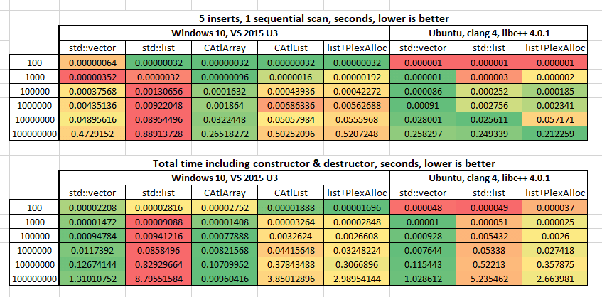
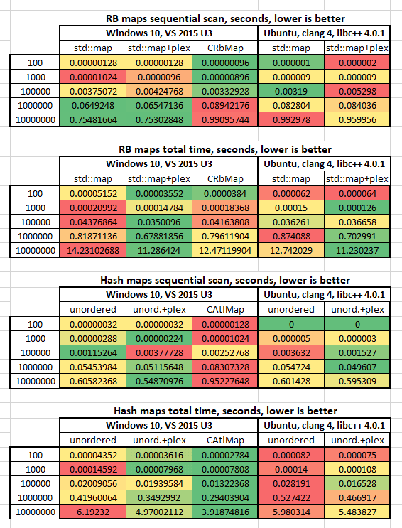

# A C++ collections benchmark #

[Inspired by this.](https://jackmott.github.io/programming/2016/08/20/when-bigo-foolsya.html)

This benchmark tests performance of various collection insert and iterate operations.

Very limited scenario, I only ran each test once. I was using i5-4460 desktop with 16GB RAM. The Linux results are from WSL running on top of the same Windows, `uname -r` says `4.4.0-43-Microsoft`, release says `Ubuntu 16.04.2 LTS`.

Windows build is made by Visual Studio 2015 update 3. Linux build by clang 4.0 with libc++ 4.0.1.

Only tested Release x64 configuration, tried to keep build options more or less equivalent (Linux version compiles to SSE2 instruction set).

Following test cases are implemented here:

1. `std::vector<int>`
1. `std::list<int>`
1. `std::list<int>` with custom CAtlPlex-like allocator
1. `CAtlArray<int>` (windows-only)
1. `CAtlList<int>` (windows-only)




Following observation can be made from the data.

On Windows, the performance improvement from my custom allocator is huge.

Microsoft’s STL and/or C++ compiler optimizes for very small collections, like 100 elements only. For larger collections, clang with libc++ is much faster. At least for this particular test case.

Even on Linux where STL is faster, the custom allocator I’ve implemented helped a lot, especially the total time (which includes memory allocation and de-allocation).

Finally, I've added Red-Black maps and hash maps to the mix. All of them is with int keys and int values.



As you see, for red-black “maps”, runtime performance isn’t affected much. The reason is, tests insert random values, so iterating them sequentially still involves a pointer chase. However allocation/deallocation became faster.

OTOH, hash maps benefit from plex allocator.
