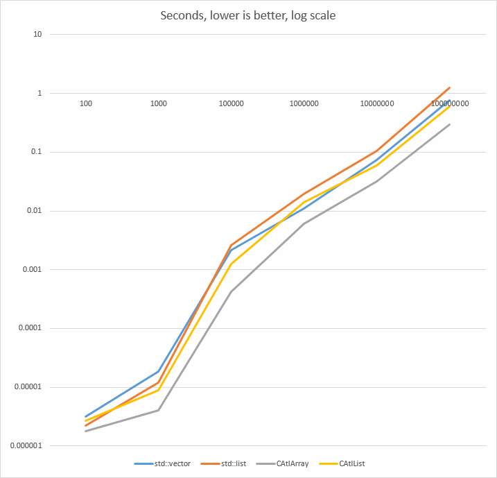

# A C++ collections benchmark #

[Inspired by this.](https://jackmott.github.io/programming/2016/08/20/when-bigo-foolsya.html)

This benchmark tests performance of collection insert and iterate operations.

Very limited scenario, I only ran each test once, used an old Sandy Bridge laptop. Only tested Release x64 configuration. Built with Visual Studio 2015 Update 3, with default compiler options.

Don’t believe the results, test with your use cases, and on your hardware.

Four test cases are implemented here:

1. `std::vector<int>`
1. `std::list<int>`
1. `CAtlArray<int>`
1. `CAtlList<int>`

I don’t know why CAtlArray is faster than std::vector. My expectation was they should perform very similarly.
 
But I do know why ATL’s lists are so much faster. The main reason is memory management.

Each instance of CAtlList class encapsulates its own memory pool.

Sure, this brings limitations. You can’t splice an ATL’s list in two. Also, if you have 1 million of lists each containing a single element, ATL list will be slower and will consume more memory. 

While generally more limited, in a typical case, when you have many elements in a container, the ATL’s version is much faster.

Same applies to ATL’s red-black tree based containers, and the hash map container. They too contain a memory pool to keep its elements locally in RAM. This causes significant performance advantage over the corresponding STL collection classes.